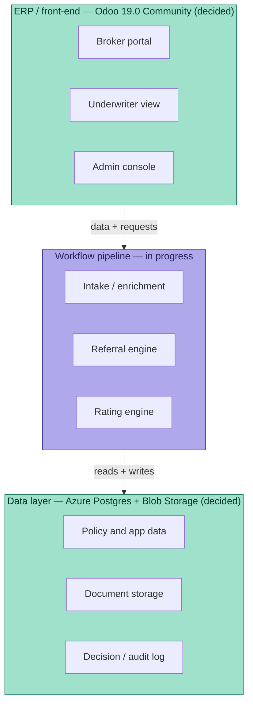

# Luxury Auto MGA — AI Underwriting Pipeline

Design and reference artifacts for an AI-driven underwriting pipeline. Luxury/high-net-worth auto is the first line of business; the platform is intended to be portable to other lines (homeowners next) via swappable schema/rating/referral "packages" rather than a rebuilt pipeline.

## Architecture — three pieces

The project splits into three peer components. Database and ERP/front-end are now decided (see ADR below); build work on both hasn't started yet. The workflow pipeline has the most build progress so far.



Purple = built so far. Teal = decided, not yet built.

- **Workflow pipeline** — the AI underwriting logic itself: intake/enrichment, the referral engine, the rating engine. Everything currently in `schemas/`, `sample-data/`, and `referral-matrices/` belongs here. Deliberately built to stay database-agnostic and UI-agnostic — it's plain JSON with no assumptions baked in about storage or presentation, so the database/ERP decision below didn't require touching it.
- **Data layer** — **PostgreSQL** (Azure Database for PostgreSQL), with **Azure Blob Storage** for documents (PDFs, appraisals, loss runs). AWS and GCP are out of scope by standing preference, not evaluated on merits. Table design is done and verified — `schemas/db/postgresql_schema.sql` — see `docs/decisions/0001-database-and-erp.md` (engine + ERP), `docs/decisions/0002-cloud-provider-azure.md` (cloud provider), and `docs/decisions/0005-database-table-design.md` (the tables themselves, including how the schemas map to real constraints — tested against a live Postgres instance, not just described).
- **ERP / front-end** — **Odoo Community Edition** (self-hosted, AGPL). Chosen together with the database, since Odoo requires Postgres. Rationale, alternatives considered (ERPNext, BindHQ/AIM/mPACS), and known open cost (custom quota-share module) in `docs/decisions/0001-database-and-erp.md`.

## Repo structure

```
schemas/                        Data structure definitions (application intake, state rating table registry, etc.)
schemas/db/                      PostgreSQL DDL implementing the JSON schemas as real tables/constraints
sample-data/                     Populated test/reference data (synthetic applications, state rating table entries)
referral-matrices/               Hard-stop and manual-review routing logic
docs/reference-materials/        Source research the build is based on (insurance industry primer, the Lloyd's/energy MGA manual used as a structural template, MGA software options research)
docs/decisions/                  Architecture decision records — what was chosen, why, and what alternatives were rejected
docs/sample-renderings/          Rendered output examples (e.g. PDF application form)
```

## Current contents

- `schemas/state_rating_table_schema.json` — registry structure defining what the rating engine is permitted to do per state (filing status, approved/prohibited rating variables, agreed-value rules, AI governance documentation requirements).
- `sample-data/state_rating_tables_sample.json` — illustrative/directional entries for CA, NY, CO, TX, FL, MA, HI, MI. **Not verified against actual SERFF filings — every field is flagged for re-verification before production use.** See the file's own `_disclaimer` field.
- `referral-matrices/luxury_auto_referral_matrix.json` — routing rules (auto-proceed / information request / manual review / hard decline) across vehicle & valuation, driver & household, account & loss history, coverage & pricing, and process & conduct categories. Wired to the edge-case test applications described below.

## Contents (full set, recovered from an earlier session)

- `schemas/luxury_auto_application_schema.json` — core application intake schema (ACORD 90 + HNW carrier supplement fields). This is the field-naming reference every other file in this repo assumes.
- `sample-data/luxury_auto_sample_applications.json` — four synthetic filled applications (clean/low-risk, moderate-risk modified vehicle, high-risk with suspended driver, exotic agreed-value edge case).
- `sample-data/luxury_auto_edge_case_applications.json` — seven synthetic applications, each designed to exercise a specific referral matrix rule (garaging mismatch, undisclosed household driver, DUI, incomplete data, VIN mismatch, salvage title, business-use misrepresentation).
- `docs/sample-renderings/luxury_auto_sample_application.pdf` — PDF rendering of one sample application (ReportLab).

## Resolved — enrichment fields now formally defined (schema v1.1)

The four ad hoc enrichment shapes different edge case files had each invented independently (`APP-0007.violation_history`, `APP-0009.vin_decode_result`, `APP-0010.title_history_check_result`, `APP-0006.external_data_flags`) are now one formal `enrichment_computed` section in `schemas/luxury_auto_application_schema.json`, parallel to `underwriting_flags_computed`. It covers `applicant_enrichment`, `additional_driver_enrichment` (keyed by a new `driver_id` field on each additional driver), `vehicle_enrichment` (keyed by `vehicle_id`), and `producer_verification`. All seven edge case applications in `sample-data/luxury_auto_edge_case_applications.json` were migrated to the formal shape, and `referral-matrices/luxury_auto_referral_matrix.json`'s `source_fields` were updated to point at it (bumped to v1.1 on both files). `underwriting_flags_computed` also gained `referral_rule_ids_triggered` — the field the NY DFS / Colorado AI-governance decision log is meant to be built from.

Also added: `enrichment_computed` for APP-0008 (the incomplete-application edge case) models what should happen when enrichment is attempted without enough identifying data to run it (MVR/sanctions come back `pending`, not a false `clear`) — worth pipeline logic specifically testing for, not just the completeness gate (DH-04) that should catch it first.

## State-specific attributes (schema v1.1)

Implemented as a base application schema plus a per-state extension namespace: `state_specific_extensions.<STATE>` in the application schema holds fields only that state needs (e.g. Michigan's no-fault/PIP selection tiers), and `state_specific_application_fields` in `schemas/state_rating_table_schema.json` lets each state's registry record declare which fields it requires there. Populated end-to-end for Michigan in `sample-data/state_rating_tables_sample.json` as the reference example — no other state in the registry currently needs anything beyond the base schema.

## Regulatory research notes

Key findings from the regulatory research behind this build (August 2026) are captured inline in `schemas/state_rating_table_schema.json`'s `build_note` and in the referral matrix's `design_note`. Headline points:
- Luxury auto is written in the **admitted market** (state DOI rate/form filing via SERFF), not the Lloyd's delegated-authority model — a structurally different governance shape than a binder-based MGA.
- CA, HI, MA, and MI ban credit-based insurance scoring for auto outright; other states permit it with varying use-context restrictions.
- NAIC's Model Bulletin on AI use had been adopted by 23 states + DC as of late 2025; NY (DFS Circular Letter 2024-7) and CO (C.R.S. §10-3-1104.9) impose additional, stricter requirements this build treats as the governance ceiling.

## Status

Early design phase. No production data. No live regulatory sign-off on any state rating table entry. Database (Azure Database for PostgreSQL), ERP/front-end (Odoo Community 19.0), and the Azure Blob Storage integration approach (leaning OCA's `fs_storage`/`fs_attachment`) are decided but not yet deployed — see `docs/decisions/` (0001 through 0006). The database table design itself is further along than "decided": it's written as real DDL and its key constraints (state-rating-table version overlap prevention, append-only decision log) were tested against a live PostgreSQL instance in this session, not just described. How Odoo reads/writes the pipeline's tables is now decided too (ADR 0006: read-only views + controlled write actions, not direct ORM ownership - Odoo's integer-only primary key requirement ruled out the simpler direct-mapping option). No Azure resources exist yet, and no Odoo instance has been stood up to build against this design.
