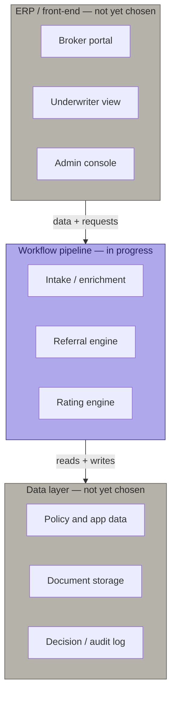

# Luxury Auto MGA — AI Underwriting Pipeline

Design and reference artifacts for an AI-driven underwriting pipeline. Luxury/high-net-worth auto is the first line of business; the platform is intended to be portable to other lines (homeowners next) via swappable schema/rating/referral "packages" rather than a rebuilt pipeline.

## Architecture — three pieces

The project splits into three peer components. Only the workflow pipeline has real design progress so far; the other two are open decisions.



Purple = built so far. Gray = design not yet started.

- **Workflow pipeline** — the AI underwriting logic itself: intake/enrichment, the referral engine, the rating engine. Everything currently in `schemas/`, `sample-data/`, and `referral-matrices/` belongs here. Deliberately built to stay database-agnostic and UI-agnostic — it's plain JSON with no assumptions baked in about storage or presentation, so swapping either of the other two pieces later shouldn't require touching this one.
- **Data layer** — not yet chosen. Needs to hold transactional policy/application data, document storage (PDFs, appraisals, loss runs), and the decision/audit log the AI governance requirements (see below) depend on.
- **ERP / front-end** — not yet chosen. See `docs/reference-materials/MGA_Software_Options.docx` for prior research comparing purpose-built MGA platforms (BindHQ, etc.) against general ERPs (Odoo/ERPNext) customized for insurance workflows.

## Repo structure

```
schemas/                        Data structure definitions (application intake, state rating table registry, etc.)
sample-data/                     Populated test/reference data (synthetic applications, state rating table entries)
referral-matrices/               Hard-stop and manual-review routing logic
docs/reference-materials/        Source research the build is based on (insurance industry primer, the Lloyd's/energy MGA manual used as a structural template, MGA software options research)
docs/sample-renderings/          Rendered output examples (e.g. PDF application form)
```

## Current contents

- `schemas/state_rating_table_schema.json` — registry structure defining what the rating engine is permitted to do per state (filing status, approved/prohibited rating variables, agreed-value rules, AI governance documentation requirements).
- `sample-data/state_rating_tables_sample.json` — illustrative/directional entries for CA, NY, CO, TX, FL, MA, HI, MI. **Not verified against actual SERFF filings — every field is flagged for re-verification before production use.** See the file's own `_disclaimer` field.
- `referral-matrices/luxury_auto_referral_matrix.json` — routing rules (auto-proceed / information request / manual review / hard decline) across vehicle & valuation, driver & household, account & loss history, coverage & pricing, and process & conduct categories. Wired to the edge-case test applications described below.

## Contents (full set, recovered from an earlier session)

- `schemas/luxury_auto_application_schema.json` — core application intake schema (ACORD 90 + HNW carrier supplement fields). This is the field-naming reference every other file in this repo assumes.
- `sample-data/luxury_auto_sample_applications.json` — four synthetic filled applications (clean/low-risk, moderate-risk modified vehicle, high-risk with suspended driver, exotic agreed-value edge case).
- `sample-data/luxury_auto_edge_case_applications.json` — seven synthetic applications, each designed to exercise a specific referral matrix rule (garaging mismatch, undisclosed household driver, DUI, incomplete data, VIN mismatch, salvage title, business-use misrepresentation).
- `docs/sample-renderings/luxury_auto_sample_application.pdf` — PDF rendering of one sample application (ReportLab).

## Known gap — schema does not yet formally define enrichment fields

The referral matrix and the edge case files both use fields that represent **pipeline enrichment output** (VIN decode results, title history checks, structured violation history, household driver checks) added *after* intake, not applicant-submitted fields. Right now these only exist ad hoc, invented independently inside individual edge case files (`APP-0007.violation_history`, `APP-0009.vin_decode_result`, `APP-0010.title_history_check_result`, `APP-0006.external_data_flags`) — `luxury_auto_application_schema.json` has no formal section for them yet.

**Action needed:** add a formal `enrichment_computed` section to the application schema (parallel to `underwriting_flags_computed`) so referral rules read from one consistent shape instead of four one-off conventions invented per edge case.

## Design note — state-specific attributes

Rather than one flat schema trying to hold every state's quirks as optional fields, the plan is a base application schema plus a per-state extension mechanism (state-specific supplemental fields, e.g. Michigan's no-fault/PIP selection tiers) — to be designed alongside the enrichment-fields fix above.

## Regulatory research notes

Key findings from the regulatory research behind this build (August 2026) are captured inline in `schemas/state_rating_table_schema.json`'s `build_note` and in the referral matrix's `design_note`. Headline points:
- Luxury auto is written in the **admitted market** (state DOI rate/form filing via SERFF), not the Lloyd's delegated-authority model — a structurally different governance shape than a binder-based MGA.
- CA, HI, MA, and MI ban credit-based insurance scoring for auto outright; other states permit it with varying use-context restrictions.
- NAIC's Model Bulletin on AI use had been adopted by 23 states + DC as of late 2025; NY (DFS Circular Letter 2024-7) and CO (C.R.S. §10-3-1104.9) impose additional, stricter requirements this build treats as the governance ceiling.

## Status

Early design phase. No production data. No live regulatory sign-off on any state rating table entry.
